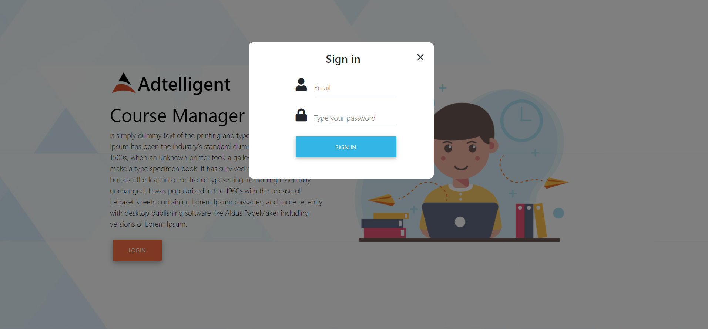
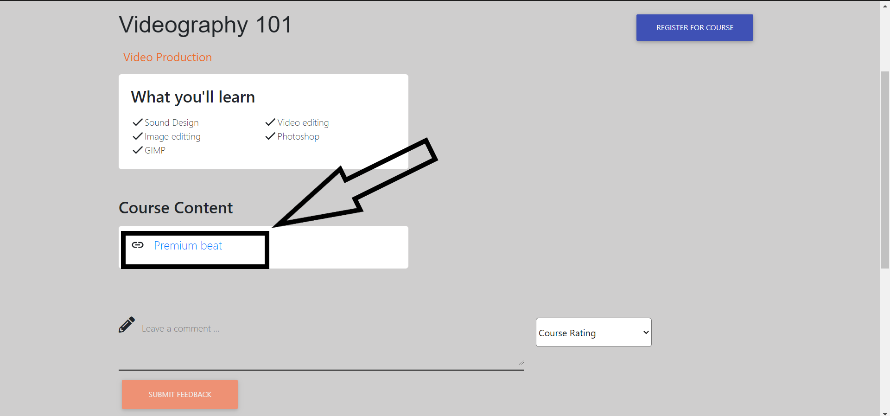
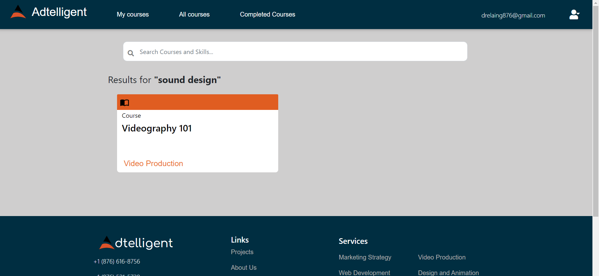
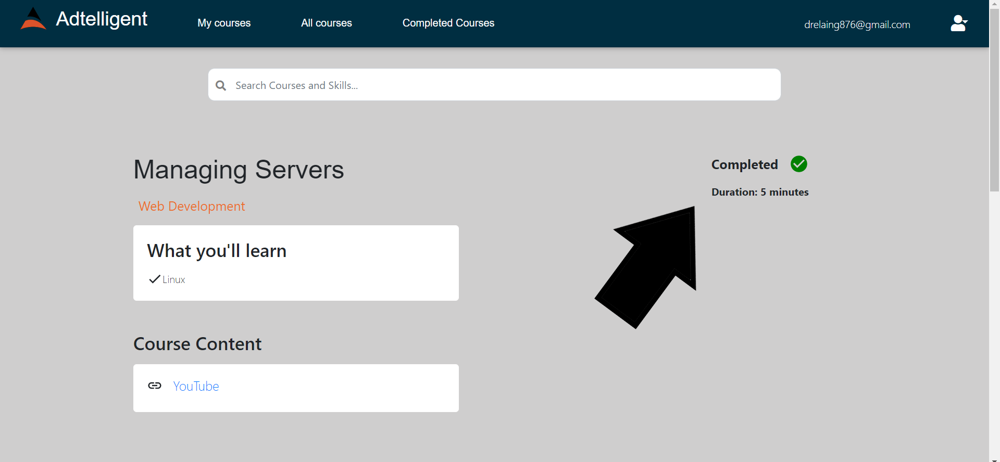
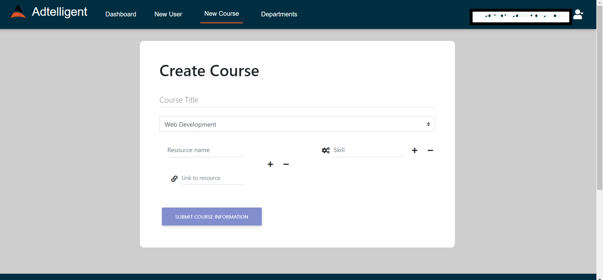
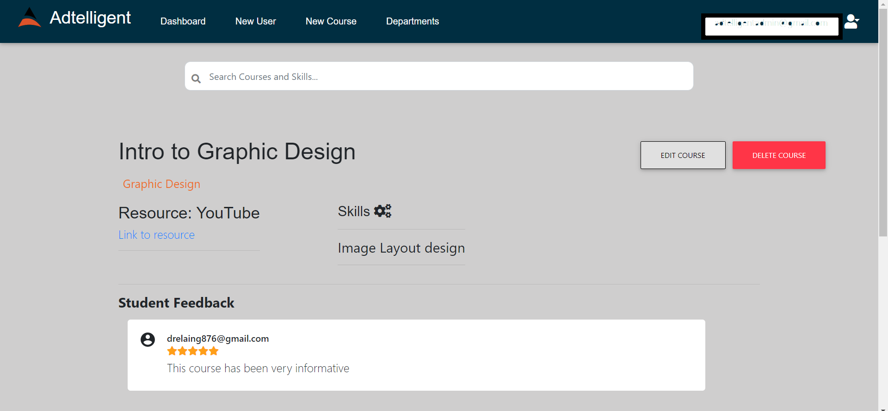

# Adtelligent Course Manager Prototype

---

### Table of Contents

- [Description](#description)
- [Requirements](#requirements)
- [License](#license)
- [Author Info](#author-info)

---

## Description

#### Problem
When joining Adtelligent, there are a set of required courses for
each new team member based on their department. However, these
courses are located on sites all over the internet, on E-Learning
websites ( e.g. Codecademy ), and other platforms such as Youtube.Because of this, it can be an issue to locate the right course just by
name for the new team members. Also, they can’t benefit from
knowing what they will learn, because there is no central location for
comments on the course.

#### Solution
The company has decided to build its own course management system to provide their team members with a central place to find these courses, specific to their department. This project is a prototype of the proposed solution, and therefore does not have all the features of the final product.

#### Technologies

- ReactJS
- NodeJS (ExpressJS)
- MongoDB
- MDBootstrap

### Requirements
- The users must be able to log in using their email address.

<!--  -->

- The user must be able to leave comments and a new rating
on the course.

<!--  -->

- The user must be able to click an external link to the course.
<!--  -->

- The user should be able to search for courses by the key skills
taught in the course and the course name.

<!--  -->

- The user should be able to mark a course as finished, with
details on how long the course duration was.

<!--  -->

- The administrator should be able to manually add more
departments and courses.
<!--  -->

- The system must have API access to the list of courses for all
CRUD operations.
<!--  -->

---

## Design Decisions
- Only the Administrator is able to create a new user. This is to prevent persons from accessing the application without being an Adtelligent employee.
- Administrators and employees login through the same portal. Ideally, the admin section should be completely separated from other users. However, for simplicity, I decided to have one login portal and to protect different API routes by using different JSON web tokens for authentication.

## Limitations
- Currently, the administrator is unable to edit department information.
- Not responsive on all devices.

---

## License

MIT License

Copyright (c) [2020] [Andre' Laing]

Permission is hereby granted, free of charge, to any person obtaining a copy
of this software and associated documentation files (the "Software"), to deal
in the Software without restriction, including without limitation the rights
to use, copy, modify, merge, publish, distribute, sublicense, and/or sell
copies of the Software, and to permit persons to whom the Software is
furnished to do so, subject to the following conditions:

The above copyright notice and this permission notice shall be included in all
copies or substantial portions of the Software.

THE SOFTWARE IS PROVIDED "AS IS", WITHOUT WARRANTY OF ANY KIND, EXPRESS OR
IMPLIED, INCLUDING BUT NOT LIMITED TO THE WARRANTIES OF MERCHANTABILITY,
FITNESS FOR A PARTICULAR PURPOSE AND NONINFRINGEMENT. IN NO EVENT SHALL THE
AUTHORS OR COPYRIGHT HOLDERS BE LIABLE FOR ANY CLAIM, DAMAGES OR OTHER
LIABILITY, WHETHER IN AN ACTION OF CONTRACT, TORT OR OTHERWISE, ARISING FROM,
OUT OF OR IN CONNECTION WITH THE SOFTWARE OR THE USE OR OTHER DEALINGS IN THE
SOFTWARE.

---

## Author Info

- Email - drelaing876@gmail.com

[Back To The Top](#description)
